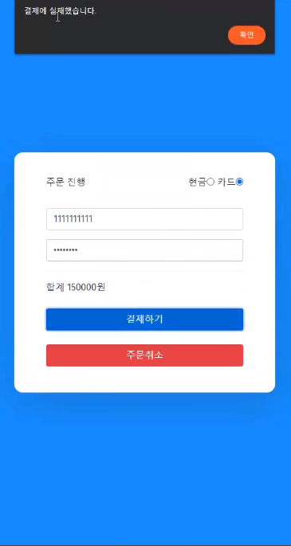

# Dawn_Restaurant

2020-2학기 소프트웨어 공학개론 새벽 코딩팀 프로젝트 - 레스토랑 관리 웹사이트

## 1. 개요

기존의 매장에서 사용하는 POS 기기는 구매에도 가격이 들고, 관리 및 유지비 또한 매달 들어간다. 이러한 점에서 테이크아웃 중심의 소규모 레스토랑에서 결제 및 매장 관리를 위해서 POS 기기를 따로 구매해야 하는 데에 드는 고정비를 줄일 수 있는, 즉 POS 기기를 대체할 수 있는 웹사이트 제작을 계획하게 되었다.  
관리자의 경우 로그인 후 자신이 소유중인 점포를 선택하여 관리 페이지로 이동하도록 설정하고, 고객의 경우 qr코드를 통해 로그인 후 해당 매장의 메뉴 확인 및 선택 창으로 이동하는 상황을 설정하고 프로젝트를 진행하였다. 
프로젝트는 유스케이스를 설정하고 유스케이스 다이어그램과 클래스 다이어그램, 그리고 시퀀스 다이어그램을 작성한 뒤 마지막으로 작성한 테스트케이스를 바탕으로 시연을 하는 것으로 진행되었으며 프로젝트 진행결과 학과에서 수여하는 우수상을 수여하였다.

## 2. 구현 기능

### 2.1) 고객 기능

1. 고객 로그인
2. 메뉴 조회
3. 메뉴 선택 및 취소
4. 결제 방법 선택
5. 결제 진행

### 2.2) 관리자 기능

1. 점포 등록
2. 점포 삭제
3. 메뉴 등록
4. 메뉴 수정
5. 메뉴 삭제
6. 직원 등록
7. 직원 수정
8. 직원 삭제
9. 주문 내역 확인
10. 주문 상태 수정
11. 매출 통계 확인

## 3. 유스케이스 다이어그램

## 4. 클래스 다이어그램

## 5. 구현 화면 및 소개

### 5.1 시나리오 1 - 관리자가 로그인 후 점포 및 메뉴, 직원 등을 추가, 수정, 삭제

- 5.1.1 로그인 화면 
  
- 5.1.2 점포 목록 화면, 점포 추가 
  
- 5.1.3 추가된 점포 확인, 점포 클릭 후 관리페이지 들어가기 
  
- 5.1.4 메뉴 추가 
  
- 5.1.5 메뉴 수정 
  
- 5.1.6 메뉴 삭제 
  
- 5.1.7 직원 추가 
  
- 5.1.8 직원 수정 
  
- 5.1.9 직원 삭제 
  

### 5.2 시나리오 2 - 고객이 로그인 후 메뉴 주문 및 결제 진행

- 5.2.1 메뉴 확인 및 주문 선택 
  
- 5.2.1 주문 현황 확인 
  
- 5.2.3 결제 방식 선택(카드 결제), 결제 실패 
  
- 5.2.4 결제 성공 
  
- 5.2.5 주문 전체 결과 확인 
  

### 5.3 시나리오 3 - 관리자가 추가된 주문 확인, 주문 상태 변경 및 매출 확인

- 5.2.1 추가된 주문 확인 
  
- 5.2.1 주문 상태 변경 
  
- 5.2.3 주문 판매 완료 후 처리(x 버튼 클릭시 주문 현황에서 사라짐)  
  
  
- 5.2.4 매출 통계 화면에서 매출 통계 확인 
  
- 5.2.5 소유 점포 리스트 화면에서 소유 점포별 매출 확인 
  
